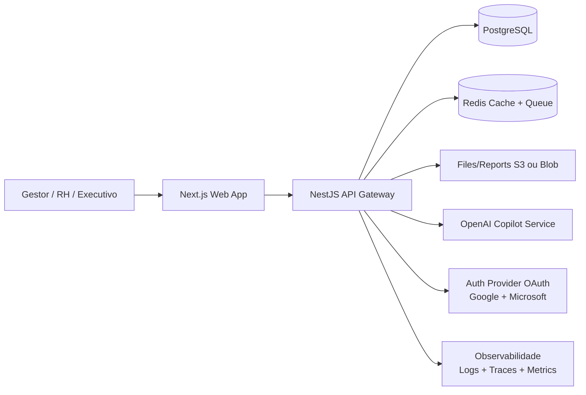

# 01. Arquitetura da Solução

## 1) Visão de alto nível

## 2) Módulos de domínio

1. **People Core**: colaboradores, cargos, senioridade, movimentações.
2. **Career & PDI**: objetivos, metas SMART, ações, revisões e templates.
3. **Feedback Hub**: feedback formal/informal, ciclos e histórico.
4. **Skills Matrix**: competências, avaliações por nível, gap analysis.
5. **1:1 & Career Talks**: pauta, atas, compromissos e follow-up.
6. **Promotion & Succession**: critérios, evidências, readiness e sucessão.
7. **AI Copilot**: recomendações, resumos executivos e risco de desengajamento.
8. **Analytics**: dashboard, 9-box, heatmaps e relatórios exportáveis.
9. **Audit & Security**: trilha de alterações, permissões e conformidade.

## 3) Arquitetura lógica (backend)

- **API Gateway (NestJS)**
  - Controle de autenticação e autorização (RBAC por perfil).
  - Versionamento de APIs (`/api/v1`).
- **Serviços por contexto**
  - `people-service`
  - `pdi-service`
  - `feedback-service`
  - `skills-service`
  - `career-talks-service`
  - `promotion-service`
  - `ai-copilot-service`
  - `analytics-service`
- **Mensageria assíncrona**
  - Geração de relatórios, cálculos de score e sugestões de IA em fila.

## 4) Segurança e governança

- SSO OAuth 2.0 com Google e Microsoft.
- RBAC por escopo organizacional: gestor vê apenas time direto + indireto configurado.
- Auditoria imutável para alterações de avaliação, feedback e promoção.
- LGPD: minimização de dados pessoais, retenção configurável e anonimização para analytics.

## 5) Experiência premium (UX)

- Navegação orientada por tarefas de liderança, não por “módulos de RH”.
- Layout executivo com KPIs na primeira dobra.
- Ações rápidas: registrar feedback, revisar PDI, preparar 1:1, gerar resumo IA.
- Interface “decision-first”: tudo responde “quem precisa de atenção agora?”.

## 6) Roadmap de implementação

### Fase 1 (MVP - 10 a 12 semanas)
- Dashboard gestor
- Gestão de colaboradores
- PDI completo
- Feedback contínuo
- 1:1 com atas

### Fase 2 (Escala - 8 semanas)
- Matriz de skills + gap analysis
- 9-box performance/potencial
- Promoção e sucessão
- Relatórios avançados/exportação

### Fase 3 (Copiloto IA - 6 semanas)
- Sugestões automáticas de PDI
- Geração de feedback estruturado
- Resumo executivo por colaborador
- Sinal de risco de desengajamento
